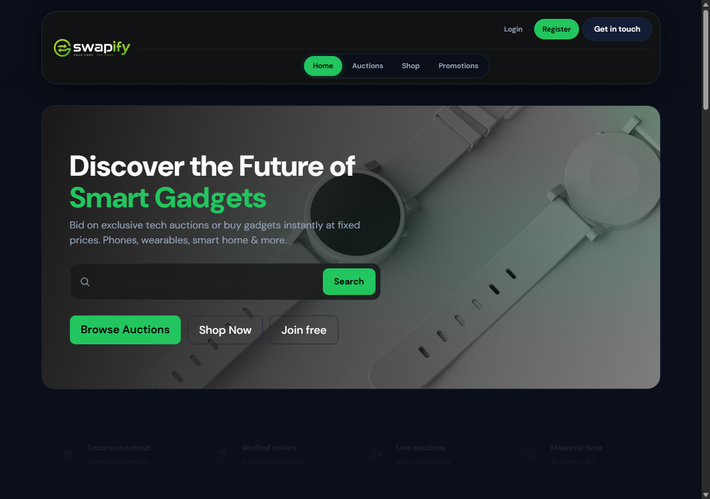
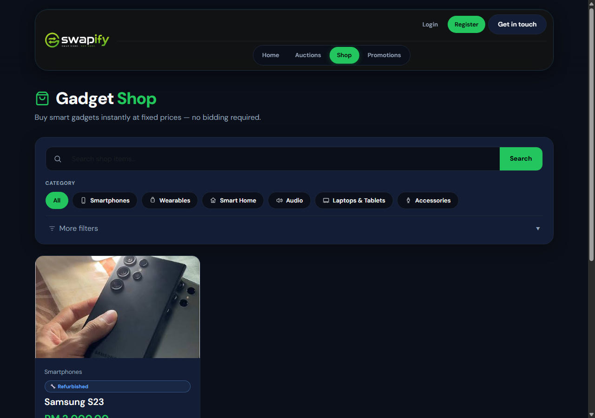
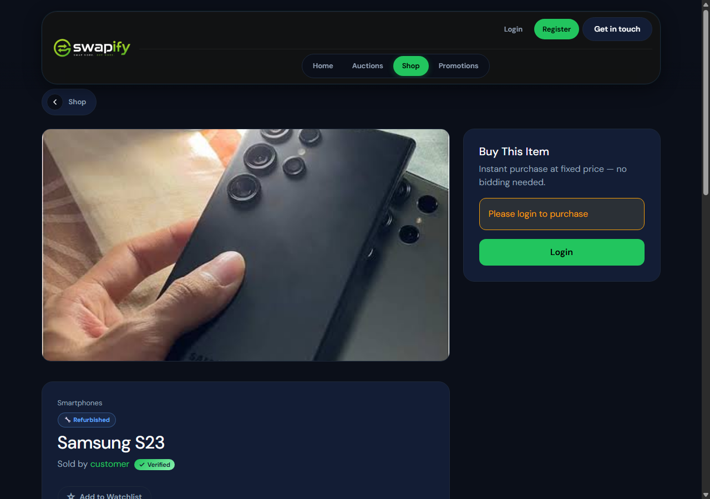
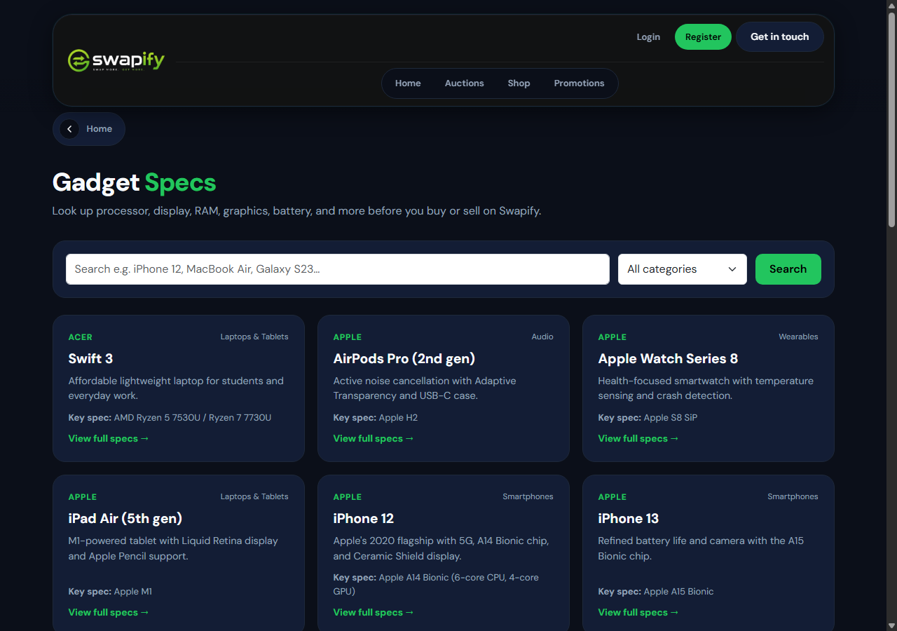
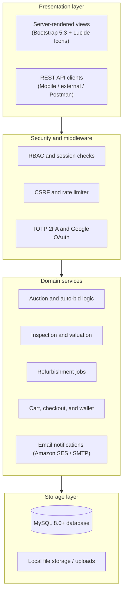

<div align="center">


# Swapify

Electronics marketplace with device trade-in, condition inspection, and live auctions.

[](https://swapify.freehosting.dev/)
[](https://www.php.net/)
[](https://www.mysql.com/)
[](https://httpd.apache.org/)
[](https://getbootstrap.com/)
[](https://datatracker.ietf.org/doc/html/rfc6238)
[](./postman_collection.json)

[Overview](#overview) / [Live demo](#live-demo) / [Interface](#interface) / [Features](#features) / [Architecture](#architecture) / [User roles](#user-roles) / [Getting started](#getting-started) / [Configuration](#configuration) / [API endpoints](#api-endpoints) / [Background worker](#background-worker)

</div>

---

## Overview

Swapify is a PHP web platform for trading, inspecting, refurbishing, and auctioning used electronics. It connects consumers, inspection officers, certified refurbishers, and buyers.

The system handles the entire second-hand device cycle:
1. A customer submits a device for trade-in.
2. An inspection officer verifies its condition, checks hardware, and issues a valuation offer.
3. Once accepted, certified resellers refurbish the item and list it for sale.
4. Buyers can either buy items directly at a fixed price or participate in live auctions with automatic bidding.

> [!NOTE]
> The repository includes both the server-rendered application and a modular REST API under `/api/`, with a ready-to-use Postman collection in `postman_collection.json`.

---

## Live demo

The application is deployed and accessible at:

**[https://swapify.freehosting.dev/](https://swapify.freehosting.dev/)**

---

## Interface

### Homepage and discovery
The storefront landing page features gadget search, category filters, trust metrics, and navigation for auctions and shop items.

<div align="center">
  
</div>

### Recommerce shop
The gadget shop lists inspected refurbished electronics with category tabs for smartphones, wearables, smart home, audio, laptops, and accessories.

<div align="center">
  
</div>

### Product detail and fixed-price purchase
Item pages show verified condition status, photos, seller details, and instant purchase options.

<div align="center">
  
</div>

### Gadget specifications catalog
Users can look up hardware specifications for supported models before submitting trade-in requests or placing bids.

<div align="center">
  
</div>

---

## Features

### Device trade-in and diagnostic inspection
- **Customer submissions**: Users submit device specifications and receive initial price estimates based on model and condition.
- **Hardware inspection**: Inspection officers complete a diagnostic checklist covering screen defects, battery capacity, camera and audio components, and device authenticity.
- **Condition grading**: Devices receive one of four grades (Mint, Good, Fair, Faulty/Parts) before moving to inventory.
- **Collection scheduling**: Customers can arrange drop-off or doorstep pickup with status tracking.

### Auctions and direct shopping
- **Live bidding engine**: Includes anti-sniping extensions, auto-bid proxy limits, real-time bid updates, and automatic winner resolution when the timer ends.
- **Direct purchase**: Standard cart and checkout flow with fulfillment status tracking.
- **Buyer and seller tools**: Item Q&A boards, in-app messaging, watchlist bookmarks, and post-purchase ratings.

### Refurbishment and reseller tools
- **Job queue**: Verified resellers can browse and claim inspected devices that require repair.
- **Repair logs**: Resellers document replaced parts and update device grades.
- **Direct listing creation**: Resellers publish completed devices directly to the marketplace catalog or auction feed.

### Security and accounts
- **Two-factor authentication**: TOTP support compatible with Google Authenticator and standard authenticator apps.
- **Single sign-on**: Google OAuth 2.0 login.
- **Defensive controls**: Prepared statements for all SQL queries, CSRF tokens on forms, session expiration, and rate-limiting on authentication attempts.

### Financial and rewards system
- **In-app wallet**: Holds user balances, reserves escrow funds for active bids, and supports withdrawal requests.
- **Fee engine**: Calculates platform commission and listing fees automatically on settled sales.
- **Eco points**: Credits reward points to users when they trade in or recycle older electronics.

---

## System architecture

The application uses a modular PHP monolith design with separate layers for routing, domain logic, and data storage.



### Folder layout

```
swapify_project/
├── api/                    # REST API endpoints grouped by domain
│   ├── admin/              # User management and sales reports
│   ├── auth/               # Login, logout, and registration
│   ├── bids/               # Bidding, bid state, and results
│   ├── chat/               # In-app messaging
│   ├── dashboard/          # Aggregated dashboard metrics
│   ├── officer/            # Diagnostics and device pickup
│   ├── reseller/           # Refurbishment jobs and post creation
│   └── sell-requests/      # Trade-in submissions
├── assets/                 # CSS themes, client-side JS, and vendor libraries
├── auth/                   # Google OAuth callback scripts
├── config/                 # Database, mail, payment, and security configs
├── database/               # SQL schema, seed files, and migration scripts
├── docs/images/            # Interface screenshots
├── includes/               # Shared functions, models, auth guards, and templates
├── uploads/                # Product photos, inspection docs, and attachments
├── admin.php               # Administrator management portal
├── auctions.php            # Auction catalog
├── checkout.php            # Order payment and checkout
├── cron.php                # Scheduled tasks worker
├── dashboard.php           # User and staff dashboard
└── index.php               # Homepage
```

---

## User roles

The application enforces role-based access across four distinct account types:

| Role | Responsibilities | Core pages |
| :--- | :--- | :--- |
| **Customer** | Trade in devices, place auction bids, buy refurbished gadgets, track orders, manage wallet. | `sell.php`, `auctions.php`, `cart.php`, `checkout.php` |
| **Inspection Officer** | Verify authenticity, run diagnostic checks, assign grades, set valuation offers, collect devices. | `check_condition.php`, `inspection_status.php`, `collect_device.php` |
| **Certified Reseller** | Accept repair tasks, log parts replacements, update condition tiers, publish new listings. | `refurbishment_jobs.php`, `refurbish_device.php`, `make_post.php` |
| **Administrator** | Manage users and resellers, review transaction reports, handle disputes, monitor platform health. | `admin.php`, `sales_report.php`, `health_check.php` |

---

## Getting started

### Requirements

Before running the project locally, make sure you have:

- PHP 8.1 or newer with these extensions: `pdo_mysql`, `openssl`, `mbstring`, `curl`, `gd`, `json`
- MySQL 8.0 or MariaDB 10.4 or newer
- Apache with `mod_rewrite` enabled (or Nginx)

> [!IMPORTANT]
> If you run Apache, set `AllowOverride All` in your virtual host configuration so the `.htaccess` file can handle routing and folder protections.

### Installation

1. Clone the repository:
   ```bash
   git clone https://github.com/your-username/swapify.git
   cd swapify
   ```

2. Point your local web server document root to the project directory:
   ```apache
   <VirtualHost *:80>
       ServerName swapify.local
       DocumentRoot "c:/path/to/swapify_project"
       <Directory "c:/path/to/swapify_project">
           AllowOverride All
           Require all granted
       </Directory>
   </VirtualHost>
   ```

3. Add `127.0.0.1 swapify.local` to your local `hosts` file.

4. Check folder write permissions for `uploads/` and `storage/`.

---

## Configuration

Settings are stored in the `config/` directory.

### Database (`config/db.php`)
```php
<?php
return [
    'host'     => 'localhost',
    'port'     => 3306,
    'dbname'   => 'swapify_db',
    'username' => 'root',
    'password' => '',
    'charset'  => 'utf8mb4',
];
```

### Email delivery (`config/mail.php`)
Supports standard SMTP or Amazon SES:
```php
<?php
return [
    'driver'     => 'smtp',
    'host'       => 'email-smtp.us-east-1.amazonaws.com',
    'port'       => 587,
    'encryption' => 'tls',
    'username'   => 'YOUR_SMTP_USERNAME',
    'password'   => 'YOUR_SMTP_PASSWORD',
    'from_email' => 'no-reply@swapify.local',
    'from_name'  => 'Swapify',
];
```

### Google login (`config/oauth.php`)
```php
<?php
return [
    'google' => [
        'client_id'     => 'YOUR_GOOGLE_CLIENT_ID.apps.googleusercontent.com',
        'client_secret' => 'YOUR_GOOGLE_CLIENT_SECRET',
        'redirect_uri'  => 'http://swapify.local/auth/google_callback.php',
    ],
];
```

---

## Database setup

1. Create the database and import the base schema:
   ```bash
   mysql -u root -p swapify_db < database/schema.sql
   ```

2. Optional: load test accounts and sample data:
   ```bash
   mysql -u root -p swapify_db < database/swapify_db_seed.sql
   ```

3. Run migrations for extra marketplace and security tables:
   ```bash
   mysql -u root -p swapify_db < database/migrate_marketplace_features.sql
   mysql -u root -p swapify_db < database/migrate_sell_and_refurbish.sql
   mysql -u root -p swapify_db < database/migrate_security.sql
   ```

> [!TIP]
> You can also run `run_sql.php` or `fix_db.php` in your browser during local development to check and update table structures automatically.

---

## API endpoints

API endpoints return JSON in this format:
```json
{
  "success": true,
  "message": "Resource retrieved successfully",
  "data": { }
}
```

### Postman collection
The file [`postman_collection.json`](./postman_collection.json) in the project root includes pre-built requests for all user roles.

1. Open Postman and import `postman_collection.json`.
2. Set the `{{base_url}}` variable to your host (such as `http://swapify.local/api`).
3. Run `POST /auth/login.php` to authenticate and save session cookies.

### Selected routes

| Endpoint | Method | Purpose |
| :--- | :--- | :--- |
| `/api/auth/login.php` | `POST` | Authenticate and verify 2FA |
| `/api/bids/highest.php?listing_id={id}` | `GET` | Return the latest bid and auction state |
| `/api/bids/place.php` | `POST` | Submit a bid or update proxy maximum |
| `/api/officer/tasks.php` | `GET` | List assigned inspection tasks |
| `/api/officer/check-condition.php` | `POST` | Save diagnostic results and assigned grade |
| `/api/reseller/refurbishment-jobs.php` | `GET` | List available devices ready for refurbishment |
| `/api/reseller/make-post.php` | `POST` | Create a marketplace listing from a finished device |

---

## Background worker

Run `cron.php` periodically to process time-sensitive tasks outside of web requests:

- Close ended auctions, mark winners, and create pending fulfillment records.
- Send outbid and ending-soon emails.
- Clean up expired rate-limit records and stale tokens.

### Crontab on Linux/macOS
```bash
* * * * * /usr/bin/php /var/www/swapify/cron.php > /dev/null 2>&1
```

### Scheduled task on Windows
```powershell
schtasks /create /sc minute /mo 1 /tn "SwapifyCron" /tr "C:\php\php.exe C:\path\to\swapify_project\cron.php"
```