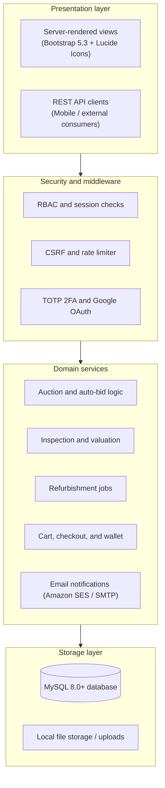

<div align="center">


# Swapify

Electronics marketplace with device trade-in, condition inspection, and live auctions.

[](https://swapify.freehosting.dev/)
[](https://www.php.net/)
[](https://www.mysql.com/)
[](https://httpd.apache.org/)
[](https://getbootstrap.com/)
[](https://datatracker.ietf.org/doc/html/rfc6238)
[](#system-architecture)

[Overview](#overview) / [Live demo](#live-demo) / [Interface](#interface) / [Features](#features) / [System architecture](#system-architecture) / [User roles](#user-roles) / [API design](#api-design) / [Tech stack](#tech-stack) / [Source code access](#source-code-access)

</div>

---

## Overview

Swapify is a web platform for trading, inspecting, refurbishing, and auctioning used electronics. It connects consumers, inspection officers, certified refurbishers, and buyers into a single recommerce workflow.

The system handles the entire second-hand device lifecycle:
1. A customer submits a device for trade-in.
2. An inspection officer verifies its condition, checks hardware, and issues a valuation offer.
3. Once accepted, certified resellers refurbish the item and list it for sale.
4. Buyers can either buy items directly at a fixed price or participate in live auctions with automatic bidding.

---

## Live demo

The application is deployed and available for testing:

**[https://swapify.freehosting.dev/](https://swapify.freehosting.dev/)**

Visitors can test:
- Storefront navigation, category filters, and search.
- The Recommerce Shop with refurbished listings.
- Item detail views with inspection condition badges and photo galleries.
- The Gadget Specs reference directory.

---

## Interface

### Homepage and discovery
The storefront landing page features gadget search, category filters, trust metrics, and navigation for auctions and shop items.

<div align="center">
  
</div>

### Recommerce shop
The gadget shop lists inspected refurbished electronics with category tabs for smartphones, wearables, smart home, audio, laptops, and accessories.

<div align="center">
  
</div>

### Product detail and fixed-price purchase
Item pages show verified condition status, photos, seller details, and instant purchase options.

<div align="center">
  
</div>

### Gadget specifications catalog
Users can look up hardware specifications for supported models before submitting trade-in requests or placing bids.

<div align="center">
  
</div>

---

## Features

### Device trade-in and diagnostic inspection
- **Customer submissions**: Users submit device specifications and receive initial price estimates based on model and condition.
- **Hardware inspection**: Inspection officers complete a diagnostic checklist covering screen defects, battery capacity, camera and audio components, and device authenticity.
- **Condition grading**: Devices receive one of four grades (Mint, Good, Fair, Faulty/Parts) before moving to inventory.
- **Collection scheduling**: Customers can arrange drop-off or doorstep pickup with status tracking.

### Auctions and direct shopping
- **Live bidding engine**: Includes anti-sniping extensions, auto-bid proxy limits, real-time bid updates, and automatic winner resolution when the timer ends.
- **Direct purchase**: Standard cart and checkout flow with fulfillment status tracking.
- **Buyer and seller tools**: Item Q&A boards, in-app messaging, watchlist bookmarks, and post-purchase ratings.

### Refurbishment and reseller tools
- **Job queue**: Verified resellers can browse and claim inspected devices that require repair.
- **Repair logs**: Resellers document replaced parts and update device grades.
- **Direct listing creation**: Resellers publish completed devices directly to the marketplace catalog or auction feed.

### Security and accounts
- **Two-factor authentication**: RFC 6238 TOTP support compatible with Google Authenticator and standard authenticator apps.
- **Single sign-on**: Google OAuth 2.0 login.
- **Defensive controls**: Prepared statements for all SQL queries, CSRF tokens on forms, session expiration, and rate-limiting on authentication attempts.

### Financial and rewards system
- **In-app wallet**: Holds user balances, reserves escrow funds for active bids, and supports withdrawal requests.
- **Fee engine**: Calculates platform commission and listing fees automatically on settled sales.
- **Eco points**: Credits reward points to users when they trade in or recycle older electronics.

---

## System architecture

The application uses a modular PHP monolith design with separate layers for routing, domain logic, and data storage.



### Modular domain layout

The codebase organizes responsibilities into clear domain modules:

- **`api/`**: RESTful controllers organized by entity (auth, bids, chat, dashboard, officer, reseller, sell-requests).
- **`includes/`**: Shared business logic, database queries, authentication guards, and reusable HTML partials.
- **`config/`**: Domain configuration for database connections, mail transport, OAuth, fees, and security policies.
- **`assets/`**: Vanilla CSS tokens, custom theme rules, and vanilla JavaScript modules for CSRF, countdowns, and form validation.

---

## User roles

The application enforces role-based access across four distinct account types:

| Role | Responsibilities | Core areas |
| :--- | :--- | :--- |
| **Customer** | Trade in devices, place auction bids, buy refurbished gadgets, track orders, manage wallet. | Trade-in forms, auction rooms, cart, and checkout |
| **Inspection Officer** | Verify authenticity, run diagnostic checks, assign grades, set valuation offers, collect devices. | Inspection queue, diagnostic forms, and collection scheduler |
| **Certified Reseller** | Accept repair tasks, log parts replacements, update condition tiers, publish new listings. | Refurbishment job board and listing publisher |
| **Administrator** | Manage users and resellers, review transaction reports, handle disputes, monitor platform health. | User management, financial reports, and system health checks |

---

## API design

The backend provides a structured REST API alongside the web interface. All responses follow a consistent JSON envelope:

```json
{
  "success": true,
  "message": "Resource retrieved successfully",
  "data": { }
}
```

### Core route groups

| Route group | Method | Description |
| :--- | :--- | :--- |
| `/api/auth/login.php` | `POST` | Authenticates credentials and validates 2FA challenges |
| `/api/bids/highest.php?listing_id={id}` | `GET` | Returns current highest bid and auction timer state |
| `/api/bids/place.php` | `POST` | Validates and accepts incoming bids or sets proxy maximums |
| `/api/officer/tasks.php` | `GET` | Lists pending device inspection assignments |
| `/api/officer/check-condition.php` | `POST` | Records physical diagnostic checks and condition tier |
| `/api/reseller/refurbishment-jobs.php` | `GET` | Surfaces available repair tasks for certified vendors |
| `/api/reseller/make-post.php` | `POST` | Converts refurbished devices into active catalog listings |

---

## Tech stack

| Layer | Technologies |
| :--- | :--- |
| **Backend** | PHP 8.1+ (PDO, OpenSSL, cURL, mbstring, GD) |
| **Database** | MySQL 8.0 / MariaDB 10.4+ |
| **Web Server** | Apache (mod_rewrite) / Nginx |
| **Frontend** | Bootstrap 5.3, Lucide Icons, Vanilla JavaScript, CSS custom properties |
| **Authentication** | RFC 6238 TOTP two-factor authentication, Google OAuth 2.0 |
| **Transactional Email** | Amazon SES, SMTP |

---

## Source code access

> [!NOTE]
> The source code and database migrations are maintained in a private repository to protect academic integrity and proprietary business workflows. Code samples, schema definitions, and technical walkthroughs are available upon request for interviewers and reviewers.